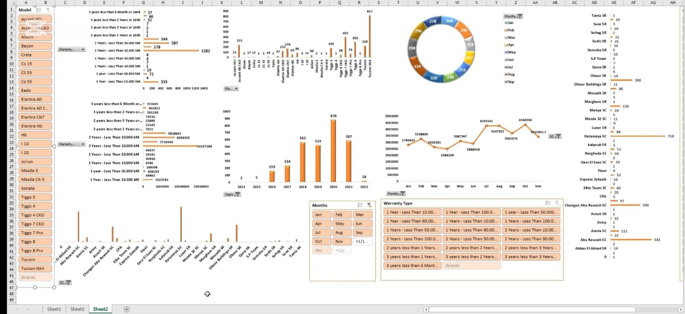

# 📊 Aman Alsharq Sales Performance (Jan–Nov)

  
  

## 🎥 Project Demo
[Watch the demo video](Sales.mp4)

## 📂 Project Overview
This Excel project provides a comprehensive sales performance report covering the period from **January to November**.  
The analysis was designed to help management close the year with actionable insights and highlight key sales trends. 🔍

## ✨ Features
- 1️⃣ Dynamic **pivot tables** for sales trend analysis  
- 2️⃣ Interactive **dashboard** with key metrics (total sales, monthly performance, top-selling regions)  
- 3️⃣ **Slicers** for seamless filtering across charts and tables  
- 4️⃣ **Conditional formatting** to highlight critical values (highest, lowest, etc.)  
- 5️⃣ Clear and impactful **charts** for data-driven decision-making  

## 🎯 Goal
The goal was to create a **visually appealing and functional report** that saves time and supports better decision-making for the management team.  

---

✨ *This project demonstrates the power of Excel in transforming raw data into actionable business insights.*
